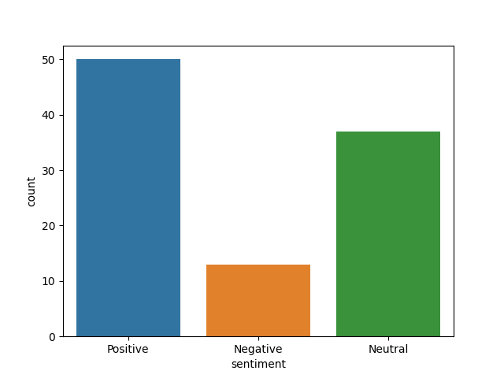
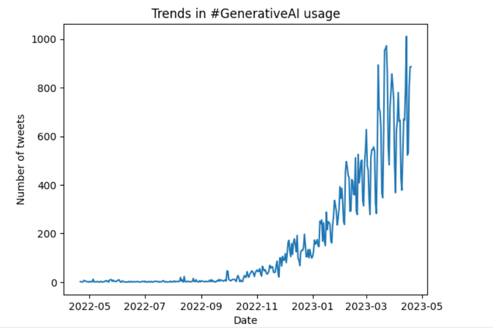
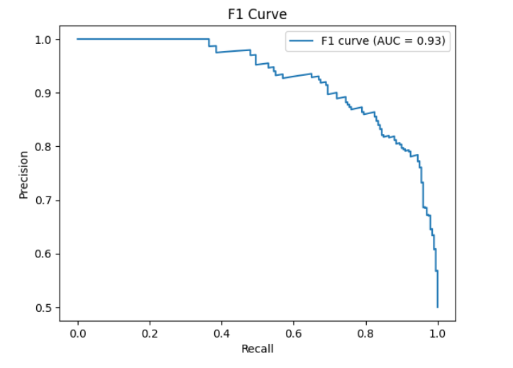
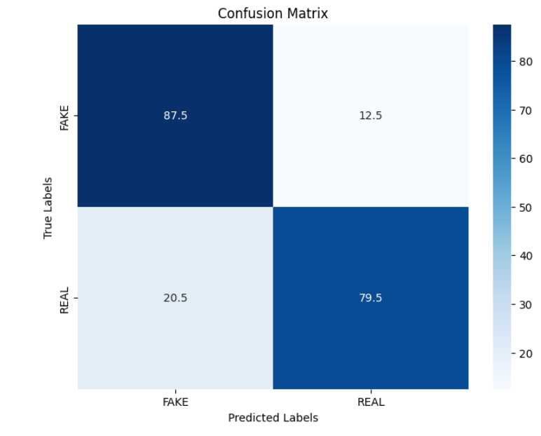
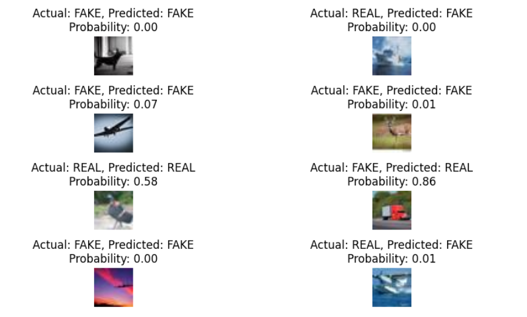
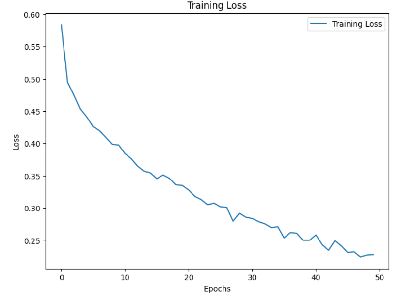

## Selected Projects in Machine Learning and Data Science

---

### Generative AI Trends and Opinion Mining
Analysing the trend of Generative AI before and after ChatGPT using tweets sourced from twitter. Opinion Mining is also performed to calculate the sentiment score and Polarity, using k-means clustering and a BERT model for sentiment analysis.This analysis helps to understand the sentiment of people towards generative AI and how it has changed after the introduction of ChatGPT.

     

[View code on Github](https://github.com/priyasarageorge/Machine-Learning-and-AI/blob/main/generative-ai-trends-and-opinion-mining.ipynb)

### Classification of real and synthetic images using VGG16 and Transfer Learning
Classification of images into "Fake" and "Real" categories using the VGG16 model and Transfer Learning on the CIFAKE Dataset. The pre-trained VGG16 model, trained on the ImageNet dataset, was used as a feature extractor by freezing its layers and adding custom layers on top for the binary classification task of identifying real and fake images. By utilizing transfer learning, the model benefits from the knowledge and feature representations learned from the ImageNet dataset, which helps improve its performance in identifying real and synthetic images, useful in fraud detection, identity theft etc.

     

[View code on Github](https://github.com/priyasarageorge/Machine-Learning-and-AI/blob/main/fake-vs-real-image-classification-using-vgg16.ipynb)

